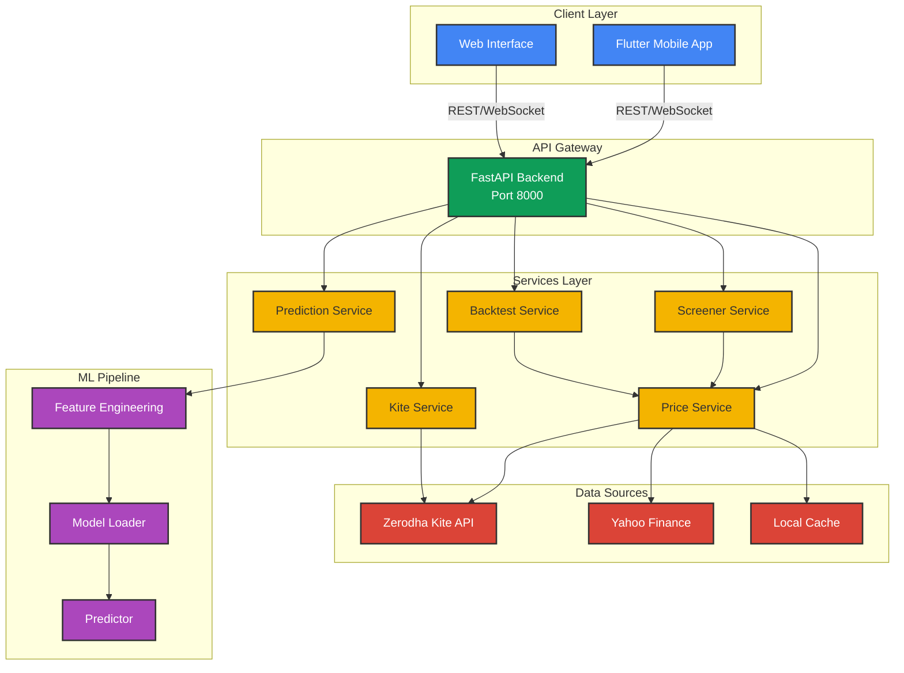
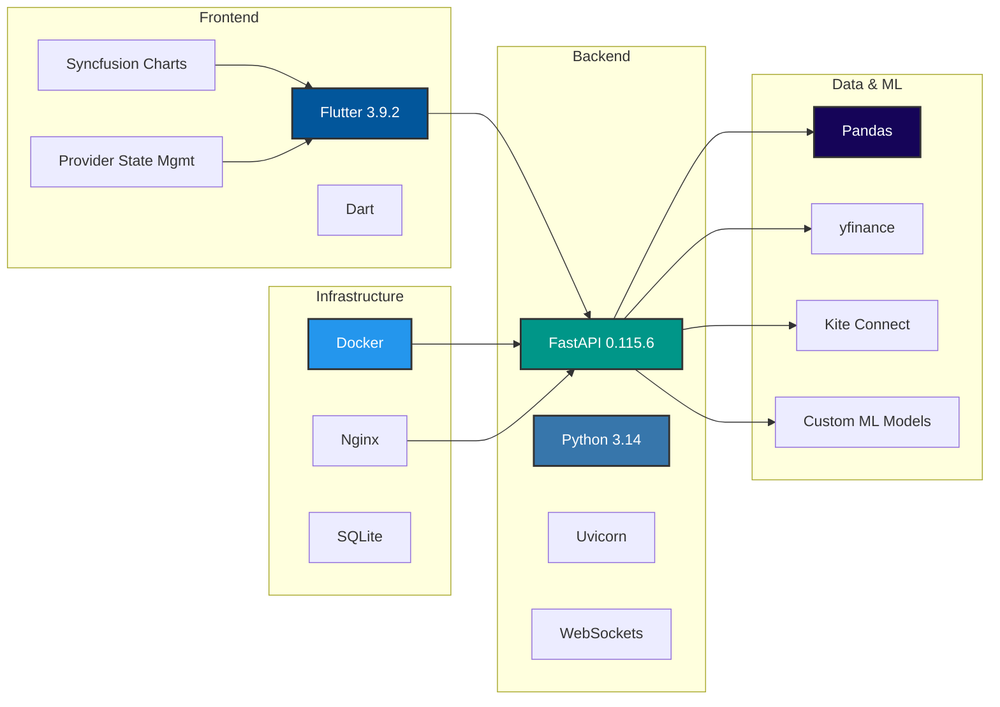
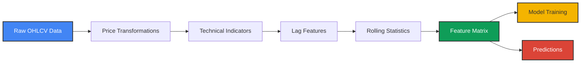

# 📈 Stock Predictor Platform

> **AI-Powered Stock Market Prediction & Analysis Platform for Indian Markets**

A comprehensive stock prediction platform combining machine learning, real-time market data, and advanced technical analysis for Indian stock market indices (NIFTY 50, BANKNIFTY, NIFTY IT). Built with Flutter for cross-platform mobile/web support and FastAPI for high-performance backend services.

[](https://www.python.org/)
[](https://flutter.dev/)
[](https://fastapi.tiangolo.com/)
[](LICENSE)

---

## 🌟 Features

### 📊 **Real-Time Market Data**
- Live price streaming via WebSocket connections
- Integration with Zerodha Kite API for real-time Indian market data
- Historical data fetching from Yahoo Finance
- Support for NIFTY 50, BANKNIFTY, and NIFTY IT indices

### 🤖 **AI-Powered Predictions**
- Machine learning models for price prediction
- Technical indicator-based feature engineering
- Confidence scoring for predictions
- Multi-timeframe analysis

### 📈 **Technical Analysis**
- 20+ technical indicators (SMA, EMA, RSI, MACD, Bollinger Bands, ATR)
- Custom screener with configurable filters
- AI-powered stock screening
- Backtesting framework for strategy validation

### 📱 **Cross-Platform Mobile App**
- Flutter-based mobile application (iOS & Android)
- Real-time price charts with Syncfusion
- Interactive gauges and visualizations
- Dark mode support

### 🔧 **Developer-Friendly**
- RESTful API with comprehensive documentation
- WebSocket support for real-time updates
- Docker containerization
- Comprehensive logging and error handling

---

## 🏗️ Architecture



---

## 🔄 System Workflow

```mermaid
sequenceDiagram
    participant User
    participant Flutter App
    participant FastAPI
    participant KiteAPI
    participant ML Engine
    participant Database
    
    User->>Flutter App: Open App
    Flutter App->>FastAPI: GET /api/v1/health
    FastAPI-->>Flutter App: System Status
    
    User->>Flutter App: Search Stock
    Flutter App->>FastAPI: GET /api/v1/search?query=RELIANCE
    FastAPI->>Database: Query Tickers
    Database-->>FastAPI: Matching Stocks
    FastAPI-->>Flutter App: Search Results
    
    User->>Flutter App: Select Stock
    Flutter App->>FastAPI: WebSocket Connect
    FastAPI->>KiteAPI: Subscribe to Ticker
    
    loop Real-time Updates
        KiteAPI-->>FastAPI: Price Update
        FastAPI-->>Flutter App: WebSocket Message
        Flutter App->>User: Update Chart
    end
    
    User->>Flutter App: Request Prediction
    Flutter App->>FastAPI: POST /api/v1/predict
    FastAPI->>ML Engine: Generate Features
    ML Engine->>ML Engine: Load Model
    ML Engine->>ML Engine: Make Prediction
    ML Engine-->>FastAPI: Prediction + Confidence
    FastAPI-->>Flutter App: Prediction Result
    Flutter App->>User: Display Prediction
    
    style User fill:#4285f4,stroke:#333,stroke-width:2px,color:#fff
    style Flutter App fill:#02569B,stroke:#333,stroke-width:2px,color:#fff
    style FastAPI fill:#009688,stroke:#333,stroke-width:2px,color:#fff
    style KiteAPI fill:#db4437,stroke:#333,stroke-width:2px,color:#fff
    style ML Engine fill:#ab47bc,stroke:#333,stroke-width:2px,color:#fff
    style Database fill:#f4b400,stroke:#333,stroke-width:2px
```

---

## 🛠️ Technology Stack



---

## 📁 Project Structure

```
stock_predictor/
├── 📱 Frontend (Flutter)
│   ├── lib/
│   │   ├── main.dart              # App entry point
│   │   ├── providers/             # State management
│   │   ├── screens/               # UI screens
│   │   ├── services/              # API clients
│   │   ├── widgets/               # Reusable components
│   │   └── theme/                 # App theming
│   ├── android/                   # Android platform
│   ├── ios/                       # iOS platform
│   └── pubspec.yaml               # Flutter dependencies
│
├── 🔧 Backend (FastAPI)
│   ├── app/
│   │   ├── api/
│   │   │   └── endpoints/         # API route handlers
│   │   │       ├── health.py      # Health checks
│   │   │       ├── predict.py     # ML predictions
│   │   │       ├── kite.py        # Kite API integration
│   │   │       ├── screener.py    # Stock screening
│   │   │       ├── websocket.py   # WebSocket handler
│   │   │       └── ...
│   │   ├── core/
│   │   │   ├── config.py          # App configuration
│   │   │   └── logging_config.py  # Logging setup
│   │   ├── ml/
│   │   │   ├── feature_engineering.py
│   │   │   ├── model_loader.py
│   │   │   └── predictor.py
│   │   ├── services/              # Business logic
│   │   │   ├── kite_service.py
│   │   │   ├── prediction_service.py
│   │   │   ├── screener_service.py
│   │   │   └── ...
│   │   └── models/
│   │       └── schemas.py         # Pydantic models
│   ├── main.py                    # FastAPI app
│   ├── requirements.txt           # Python dependencies
│   └── Dockerfile                 # Container config
│
├── 📊 Data & ML
│   ├── data/
│   │   ├── raw/                   # Raw market data
│   │   └── processed/             # Processed features
│   ├── models/                    # Trained ML models
│   ├── notebooks/                 # Jupyter notebooks
│   │   ├── 01_data_ingestion.py
│   │   └── 02_feature_engineering.py
│   └── src/                       # Core ML modules
│       ├── data_ingest.py
│       ├── features.py
│       └── utils.py
│
├── 🚀 Deployment
│   ├── docker-compose.yml         # Multi-container setup
│   ├── nginx.conf                 # Reverse proxy config
│   └── deployment/                # Deployment scripts
│
└── 📝 Configuration
    ├── config.json                # App configuration
    ├── .env.example               # Environment template
    └── setup_env.sh               # Environment setup
```

---

## 🚀 Quick Start

### Prerequisites

- **Python 3.10+** (3.14 recommended)
- **Flutter 3.9.2+**
- **Docker** (optional, for containerized deployment)
- **Zerodha Kite API** credentials (for live market data)

### Backend Setup

1. **Clone the repository**
   ```bash
   git clone https://github.com/yourusername/stock_predictor.git
   cd stock_predictor
   ```

2. **Set up Python environment**
   ```bash
   # Create virtual environment
   python3 -m venv venv
   source venv/bin/activate  # On Windows: venv\Scripts\activate
   
   # Install dependencies
   cd backend
   pip install -r requirements.txt
   ```

3. **Configure environment variables**
   ```bash
   # Copy example env file
   cp backend/.env.example backend/.env
   
   # Edit .env and add your API keys
   nano backend/.env
   ```

4. **Run the backend server**
   ```bash
   cd backend
   python run.py
   ```
   
   The API will be available at `http://localhost:8000`
   - API Documentation: `http://localhost:8000/docs`
   - Alternative Docs: `http://localhost:8000/redoc`

### Frontend Setup

1. **Install Flutter dependencies**
   ```bash
   flutter pub get
   ```

2. **Run the app**
   ```bash
   # For mobile (iOS/Android)
   flutter run
   
   # For web
   flutter run -d chrome
   
   # For desktop
   flutter run -d macos  # or windows/linux
   ```

### Docker Deployment

```bash
# Build and run with Docker Compose
docker-compose up -d

# View logs
docker-compose logs -f

# Stop services
docker-compose down
```

---

## 📖 API Documentation

### Core Endpoints

#### Health Check
```http
GET /health
```
Returns system health status and version information.

#### Search Stocks
```http
GET /api/v1/search?query={symbol}
```
Search for stocks by symbol or name.

**Example:**
```bash
curl http://localhost:8000/api/v1/search?query=RELIANCE
```

#### Get Stock Price
```http
GET /api/v1/price/{symbol}
```
Get current price and basic information for a stock.

#### Get Predictions
```http
POST /api/v1/predict
Content-Type: application/json

{
  "symbol": "RELIANCE",
  "timeframe": "1d"
}
```

#### Stock Screener
```http
POST /api/v1/screener
Content-Type: application/json

{
  "min_price": 100,
  "max_price": 5000,
  "min_volume": 100000,
  "rsi_min": 30,
  "rsi_max": 70
}
```

#### WebSocket Connection
```javascript
const ws = new WebSocket('ws://localhost:8000/api/v1/ws/prices');

ws.onopen = () => {
  ws.send(JSON.stringify({
    action: 'subscribe',
    symbols: ['RELIANCE', 'TCS', 'INFY']
  }));
};

ws.onmessage = (event) => {
  const data = JSON.parse(event.data);
  console.log('Price update:', data);
};
```

### Kite API Integration

#### Authenticate
```http
GET /api/v1/kite/login
```
Redirects to Kite login page for authentication.

#### Get Access Token
```http
GET /api/v1/kite/callback?request_token={token}
```
Callback endpoint after Kite authentication.

---

## 🔬 Technical Indicators

The platform includes comprehensive technical analysis with the following indicators:

| Category | Indicators |
|----------|-----------|
| **Trend** | SMA (20, 50, 200), EMA (12, 26), MACD |
| **Momentum** | RSI (14), MACD Histogram, Rate of Change |
| **Volatility** | Bollinger Bands, ATR (14), Standard Deviation |
| **Volume** | Volume MA, Price-Volume Trend, OBV |
| **Custom** | Price Returns, Log Returns, Rolling Statistics |

### Feature Engineering Pipeline



---

## 📊 Data Sources

### Supported Indices

| Index | Symbol | Description |
|-------|--------|-------------|
| **NIFTY 50** | ^NSEI | India's benchmark stock market index |
| **BANKNIFTY** | ^NSEBANK | Banking sector index |
| **NIFTY IT** | ^CNXIT | Information Technology sector index |

### Data Providers

1. **Yahoo Finance** (`yfinance`)
   - Historical OHLCV data
   - Free, no API key required
   - Daily updates

2. **Zerodha Kite API**
   - Real-time market data
   - Live price streaming
   - Requires API credentials

---

## 🧪 Development

### Running Tests

```bash
# Backend tests
cd backend
pytest tests/ -v

# Run specific test
pytest tests/test_search.py -v

# With coverage
pytest --cov=app tests/
```

### Code Quality

```bash
# Format code
black backend/app/

# Lint
flake8 backend/app/

# Type checking
mypy backend/app/
```

### Environment Setup Script

```bash
# Automated setup
chmod +x setup_env.sh
./setup_env.sh
```

---

## 📱 Mobile App Features

### Screens

1. **Home Dashboard**
   - Market overview
   - Trending stocks
   - Quick access to favorites

2. **Stock Detail**
   - Real-time price chart
   - Technical indicators
   - AI predictions
   - Historical performance

3. **Screener**
   - Custom filters
   - AI-powered recommendations
   - Saved screens

4. **Watchlist**
   - Personal stock list
   - Real-time updates
   - Price alerts

---

## 🔐 Configuration

### Environment Variables

Create a `.env` file in the `backend/` directory:

```env
# Environment
ENVIRONMENT=development
DEBUG=True

# Server
HOST=0.0.0.0
PORT=8000

# API Keys
ALPHA_VANTAGE_API_KEY=your_key_here
KITE_API_KEY=your_kite_api_key
KITE_API_SECRET=your_kite_api_secret
KITE_REDIRECT_URL=http://localhost:8000/api/v1/kite/callback

# Database
DATABASE_URL=sqlite:///./stock_predictor.db
```

### App Configuration (`config.json`)

```json
{
  "indices": {
    "NIFTY50": "^NSEI",
    "BANKNIFTY": "^NSEBANK",
    "NIFTYIT": "^CNXIT"
  },
  "data": {
    "start_date": "2020-01-01",
    "interval": "1d"
  },
  "ai": {
    "entry_threshold": 0.55,
    "exit_threshold": 0.5,
    "min_confidence": 0.6
  }
}
```

---

## 🤝 Contributing

Contributions are welcome! Please follow these steps:

1. Fork the repository
2. Create a feature branch (`git checkout -b feature/AmazingFeature`)
3. Commit your changes (`git commit -m 'Add some AmazingFeature'`)
4. Push to the branch (`git push origin feature/AmazingFeature`)
5. Open a Pull Request

### Contribution Guidelines

- Follow the existing code style
- Write tests for new features
- Update documentation as needed
- Ensure all tests pass before submitting PR

---

## 📄 License

This project is licensed under the MIT License - see the [LICENSE](LICENSE) file for details.

---

## ⚠️ Disclaimer

> **IMPORTANT:** This platform is for educational and research purposes only. Stock market predictions are inherently uncertain and should not be used as the sole basis for investment decisions. Always consult with qualified financial advisors before making any investment decisions. Past performance does not guarantee future results.

---

## 🙏 Acknowledgments

- **Yahoo Finance** for providing free historical market data
- **Zerodha Kite** for real-time Indian market data API
- **FastAPI** for the excellent web framework
- **Flutter** for cross-platform mobile development
- **Syncfusion** for beautiful chart components

---


---

## 🗺️ Roadmap

- [ ] Add more ML models (LSTM, Transformer)
- [ ] Implement portfolio tracking
- [ ] Add options chain analysis
- [ ] Support for more exchanges (BSE, MCX)
- [ ] Mobile push notifications
- [ ] Advanced charting tools
- [ ] Social sentiment analysis
- [ ] Paper trading simulator

---

<div align="center">


⭐ Star this repo if you find it helpful!

</div>
